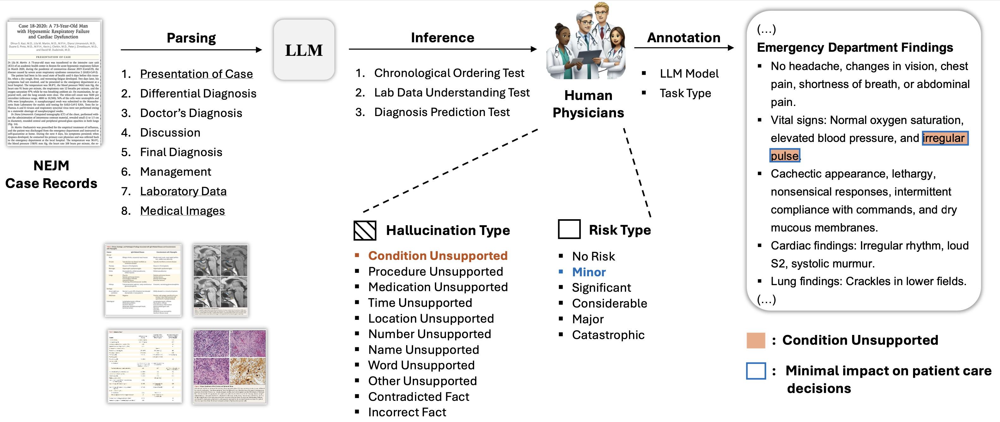

<div align=center>

</div>
<h2 align="center"><a href="https://www.medrxiv.org/content/10.1101/2025.02.28.25323115v1"> Medical Hallucination in Foundation Models and Their Impact on Healthcare </a></h2>
<h5 align="center"> If you like our project, please give us a star ⭐ on GitHub for the latest update.</h5>

<h5 align="center">

   [](https://www.medrxiv.org/content/10.1101/2025.02.28.25323115v1)
   [](https://medical-hallucination2025.github.io/)


</h5>

## Medical Hallucination in Foundation Models and Their Impact on Healthcare (2025)
Foundation Models that are capable of processing and generating multi-modal data have transformed AI’s role in medicine. However, a key limitation of their reliability is hallucination, where inaccurate or fabricated information can impact clinical decisions and patient safety. We define **medical hallucination** as any instance in which a model generates misleading medical content. This paper examines the unique characteristics, causes, and implications of medical hallucinations, with a particular focus on how these errors manifest themselves in real-world clinical scenarios. Our contributions include (1) a taxonomy for understanding and addressing medical hallucinations, (2) benchmarking models using medical hallucination dataset and physician-annotated LLM responses to real medical cases, providing direct insight into the clinical impact of hallucinations, and (3) a multi-national clinician survey on their experiences with medical hallucinations. Our results reveal that inference techniques such as Chain-of-Thought (CoT) and Search Augmented Generation can effectively reduce hallucination rates. However, despite these improvements, non-trivial levels of hallucination persist. These findings underscore the ethical and practical imperative for robust detection and mitigation strategies, establishing a foundation for regulatory policies that prioritize patient safety and maintain clinical integrity as AI becomes more integrated into healthcare. The feedback from clinicians highlights the urgent need for not only technical advances but also for clearer ethical and regulatory guidelines to ensure patient safety.


##  📣 News
[2025-03-03] 🎉🎉🎉 Our preprint paper has been submitted to [medRxiv](https://www.medrxiv.org/content/10.1101/2025.02.28.25323115v1).

## ⚡ Contact

If you want to add your work or model to this list, please do not hesitate to email ybkim95@mit.edu.

## Contents
- [Setup](#setup)
- [What makes Medical Hallucination Special?](#difference)
- [Hallucinations in Medical LLMs](#llms)
- [Survey on Medical Hallucination among Healthcare Professionals](#survey)
- [Medical Hallucination Benchmarks](#benchmarks)
- [LLM Experiments on Medical Hallucination Benchmark](#llm-exp)
- [Detection Methods for Medical Hallucination](#detection)
- [Mitigation Methods for Medical Hallucination](#mitigation)
- [Human Physicians' Medical Hallucination Annotation](#annotation)

## Setup

### Step 1: Clone the Repository

```bash
git clone https://github.com/mitmedialba/medical_hallucination.git
cd medical_hallucination
```

### Step 2: Install Dependencies

```bash
# Create a virtual environment (recommended)
conda create -n medrag python=3.10
conda activate medrag

# Install required packages
pip install -r requirements.txt
```

### Step 3: Clone MedRAG Repository

The experiments use the [MedRAG framework](https://github.com/Teddy-XiongGZ/MedRAG) for retrieval-augmented generation.

```bash
# Clone MedRAG into the project directory
git clone https://github.com/Teddy-XiongGZ/MedRAG.git
cd MedRAG
```

### Step 4: Download MedRAG Corpus (Optional, for RAG method)

If you want to use the MedRAG mitigation method, you need to download the medical corpus:

```bash
# Inside the MedRAG directory
python -m src.download_corpus --corpus_name Textbooks --save_dir ./corpus
```

This will download the medical textbook corpus (~5GB) used for retrieval.

**Note**: If you skip this step, the MedRAG method will be skipped during experiments.

### Step 5: Configure API Keys

```bash
# Go back to the project root
cd ..

# Copy the example environment file
cp .env.example .env

# Edit .env and add your API keys
nano .env  # or use your preferred text editor
```

Add your API keys to the `.env` file:

```bash
OPENAI_API_KEY=sk-...
GOOGLE_API_KEY=AIza...
OPENROUTER_API_KEY=sk-or-v1-...
TAVILY_API_KEY=tvly-...
```

**Where to get API keys:**
- **OpenAI**: https://platform.openai.com/api-keys (for GPT models)
- **Google**: https://aistudio.google.com/app/apikey (for Gemini models)
- **OpenRouter**: https://openrouter.ai/keys (for DeepSeek and other models)
- **Tavily**: https://tavily.com (for internet search)

**Note**: You only need API keys for the models you plan to test.

### Step 6: Prepare Dataset

Ensure the dataset is in the correct location:

```
medical_hallucination/
├── dataset/
│   ├── medhalt_reasoning_fake.csv
│   ├── medhalt_reasoning_FCT.csv
│   ├── medhalt_reasoning_nota.csv
│   └── original/
│       ├── reasoning_fake.csv
│       ├── reasoning_FCT.csv
│       └── reasoning_nota.csv
```

The `dataset/` directory contains prompts for models, and `dataset/original/` contains ground truth labels.

---

## Running Experiments

### Basic Usage

Run experiments with a single model:

```bash
python run_experiments.py --models gpt-4o --seed 0
```

### Run Multiple Models

```bash
python run_experiments.py \
  --models gpt-4o gemini-2.0-flash \
  --seed 0 \
  --output_dir ./results
```

### Models

**OpenAI Models:**
- `gpt-4o`
- `gpt-4o-mini`
- `gpt-5`
- `o1`
- `o3-mini`

**Google Models:**
- `gemini-2.5-pro`

**Medical-Specialized Models (HuggingFace):**
- `medgemma-4b-it`
- `AlpaCare-llama2-13b`
- `medalpaca-13b`
- `PMC_LLaMA_13B`

**Other Models:**
- `deepseek-r1` (via OpenRouter)

### Advanced Options

```bash
python run_experiments.py \
  --models gpt-4o \
  --dataset_path ./dataset \
  --output_dir ./my_results \
  --seed 42
```

**Arguments:**
- `--models`: List of model names (required)
- `--dataset_path`: Path to dataset directory (default: `./dataset`)
- `--output_dir`: Output directory for results (default: `./results`)
- `--seed`: Random seed for reproducibility (default: `0`)

### Understanding the Experiment Process

For each model and dataset combination, the script will:

1. **Load the model** (if HuggingFace-based) or initialize API client
2. **Process each question** through 5 mitigation methods:
   - **Base**: No additional mitigation
   - **Prompting**: System prompt requesting truthful responses
   - **CoT (Chain-of-Thought)**: "Let's think step-by-step" instruction
   - **MedRAG**: Retrieval-augmented generation with medical corpus
   - **Internet Search**: Web search augmentation via Tavily API
3. **Save intermediate results** every 10 samples (for recovery)
4. **Save final results** in JSON format

### Output Format

Results are saved as JSON files:

```
results/
├── gpt-4o_medhalt_reasoning_FCT_seed0.json
├── gpt-4o_medhalt_reasoning_fake_seed0.json
├── gpt-4o_medhalt_reasoning_nota_seed0.json
├── gemini-2.0-flash_medhalt_reasoning_FCT_seed0.json
└── ...
```

Each JSON file contains:

```json
{
  "seed": 0,
  "results": [
    {
      "question": "What is...",
      "options": {"A": "...", "B": "...", "C": "...", "D": "..."},
      "base_output": "Model response...",
      "prompting_output": "Model response...",
      "cot_output": "Model response...",
      "medrag_output": "A",
      "internetsearch_output": "Model response..."
    },
    ...
  ]
}
```

---

## Evaluating Results

### Basic Evaluation

After running experiments, evaluate the results:

```bash
python evaluate_results.py \
  --results_dir ./results \
  --models gpt-4o gemini-2.0-flash \
  --tasks FCT fake nota
```

### Metrics

The evaluation script calculates:

1. **Accuracy**: Percentage of correct predictions
2. **Pointwise Score**: +1 for correct, -0.25 for incorrect
3. **Similarity Scores** (using UMLS-BERT embeddings):
   - **Answer Similarity**: Cosine similarity between model output and correct answer
   - **Question Similarity**: Cosine similarity between model output and question
   - **Combined Score**: Average of answer and question similarity

### Understanding Evaluation Output

The script will print:

```
[EVALUATION RESULTS - Averaged Performance Across Tasks]
================================================================================

Model: MODEL_NAME
--------------------------------------------------------------------------------

  Method: BASE
    Accuracy: 75.50% (151/200)
    Pointwise Score: 0.69
    Similarity Scores:
      Overall answer_similarity: 0.823 (±0.145)
      Overall question_similarity: 0.756 (±0.132)
      Overall combined_score: 0.789 (±0.125)

    Per-Task Similarity Scores:
      FCT:
        answer_similarity: 0.841 (±0.121)
        question_similarity: 0.769 (±0.118)
        combined_score: 0.805 (±0.109)
      fake:
        answer_similarity: 0.798 (±0.167)
        question_similarity: 0.741 (±0.145)
        combined_score: 0.769 (±0.142)
      nota:
        answer_similarity: 0.831 (±0.141)
        question_similarity: 0.758 (±0.133)
        combined_score: 0.794 (±0.124)

  Method: MEDRAG
    Accuracy: 82.00% (164/200)
    Pointwise Score: 0.77
    ...
```

### Custom Evaluation

You can also evaluate specific models or tasks:

```bash
# Evaluate only one model
python evaluate_results.py \
  --results_dir ./results \
  --models gpt-4o \
  --tasks FCT fake nota

# Evaluate only specific tasks
python evaluate_results.py \
  --results_dir ./results \
  --models gpt-4o gemini-2.0-flash \
  --tasks FCT
```

---

## Outputs

### Task Types

Our experiments use three types of medical reasoning tasks:

1. **FCT (Factual Consistency Testing)**
   - Tests model's ability to provide factually correct medical information
   - Questions with definitive correct answers

2. **fake (Hallucination Detection)**
   - Tests model's ability to recognize when it lacks knowledge
   - Correct answer is always "I do not know"

3. **nota (None of the Above)**
   - Tests model's ability to recognize when none of the options are correct
   - Requires critical evaluation of all options

### Mitigation Methods

1. **Base**: Standard inference without additional prompting
2. **System Prompting**: System prompt: "You are a truthful medical assistant..."
3. **CoT**: Chain-of-thought prompting with "Let's think step-by-step"
4. **MedRAG**: Retrieval-augmented generation using medical textbooks
5. **Internet Search**: Web search augmentation using Tavily API

---

## What makes Medical Hallucination Special? <a name="difference"></a>

<figure>
    
    <figcaption>Figure 1. A visual taxonomy of medical hallucinations in LLMs, organized into five main clusters.</figcaption>
</figure>

<br><br>

LLM hallucinations refer to outputs that are factually incorrect, logically inconsistent, or inadequately grounded in reliable sources. In general domains, these hallucinations may take the form of factual errors or non-sequiturs. In medicine, they can be more challenging to detect because the language used often appears clinically valid while containing critical inaccuracies. Medical hallucinations exhibit two distinct features compared to their general-purpose counterparts. First, they arise within specialized tasks such as diagnostic reasoning, therapeutic planning, or interpretation of laboratory findings, where inaccuracies have immediate implications for patient care. Second, these hallucinations frequently use domain-specific terms and appear to present coherent logic, which can make them difficult to recog- nize without expert scrutiny. In settings where clinicians or patients rely on AI recommendations, a tendency potentially heightened in domains like medicine, unrecognized errors risk delaying proper interventions or redirecting care pathways. Moreover, the impact of medical hallucinations is far more severe. Errors in clinical reasoning or misleading treatment recommendations can directly harm patients by delaying proper care or leading to inappropriate interventions. Furthermore, the detectability of such hallucinations depends on the level of domain expertise of the audience and the quality of the prompting provided to the model. Domain experts are more likely to identify subtle inaccuracies in clinical terminology and reasoning, whereas non-experts may struggle to discern these errors, thereby increasing the risk of misinterpretation. These distinctions are crucial: whereas general hallucinations might lead to relatively benign mistakes, medical hallucinations can undermine patient safety and erode trust in AI-assisted clinical systems.

Our primary contributions include:

1. A **taxonomy** for medical hallucination in Large Language Models
2. **Benchmarking models** using a medical hallucination dataset and physician-annotated LLM responses to real medical cases, providing direct insight into the clinical impact of hallucinations.
3. A **multi-national clinician survey** on their experiences with medical hallucinations.

These contributions collectively *advance our understanding of medical hallucinations and their mitigation strategies*, with implications extending to regulatory frameworks and best practices for the deployment of AI in clinical settings.

<br>

## Hallucinations in Medical LLMs <a name="llms"></a>
Please refer to table 1 of our paper for examples of medical hallucination in clinical tasks, and table 2 for an organized taxonomy of medical hallucination. 
| Title | Institute | Date | Code
| :---------------------------------------------------------------------------------------------------------------------------------------------------------------------------------- | :------------------: | :-----------: | :-------------: |
| [MedHalu: Hallucinations in Responses to Healthcare Queries by Large Language Models](https://arxiv.org/abs/2409.19492) | University of Surrey<br>Georgia Institute of Technology | 2024-09 | N/A
| [Creating trustworthy llms: Dealing with hallucinations in healthcare ai](https://arxiv.org/abs/2311.01463) |  University of Washington Bothell <br>Kaiser Permanente | 2023-09 | N/A
| [Knowledge Overshadowing Causes Amalgamated Hallucination in Large Language Models](https://arxiv.org/pdf/2407.08039) |  University of Illinois Urbana-Champaign<br>The Hong Kong Polytechnic University<br>Stanford University | 2024-07 | N/A
| [Mechanistic Understanding and Mitigation of Language Model Non-Factual Hallucinations](https://arxiv.org/pdf/2403.18167v2) |  University of Toronto<br>McGill University<br>Mila– Québec AI Institute<br>University of California, Riverside | 2024-06 | N/A
| [Language models are susceptible to incorrect patient self diagnosis in medical applications](https://arxiv.org/pdf/2309.09362) | University of Maryland, College Park<br>Johns Hopkins University | 2023-09 | N/A
| [The Dawn After the Dark: An Empirical Study on Factuality Hallucination in Large Language Models](https://arxiv.org/pdf/2401.03205) | Renmin University of China<br>Université de Montréal | 2024-01 | https://github.com/RUCAIBox/HaluEval-2.0

<br>

## Survey on Medical Hallucination among Healthcare Professionals <a name="survey"></a>

To investigate the perceptions and experiences of healthcare professionals and researchers regarding the use of AI / LLM tools, particularly regarding medical hallucinations, we conducted a survey aimed at individuals in the medical, research, and analytical fields (Figure 9). A total of 75 professionals participated, primarily holding MD and/or PhD degrees, representing a diverse range of disciplines. The survey was conducted over a 94-day period, from September 15, 2024, to December 18, 2024, confirming the significant adoption of AI/LLM tools across these fields. Respondents indicated varied levels of trust in these tools, and notably, a substantial proportion reported encountering medical hallucinations—factually incorrect yet plausible outputs with medical relevance—in tasks critical to their work, such as literature reviews and clinical decision-making. Participants described employing verification strategies like cross-referencing and colleague consultation to manage these inaccuracies.

<figure>
    
	
    <figcaption>Figure 9. Key insights from a multi-national clinician survey on medical hallucinations in clinical practice.</figcaption>
</figure>

<br><br>


## Medical Hallucination Benchmarks <a name="benchmarks"></a>
Please refer to table 3 of our paper for details on medical hallucination benchmarks. 
| Title | Institute | Date | Code 
| :---------------------------------------------------------------------------------------------------------------------------------------------------------------------------------- | :------------------: | :-----------: | :-------------: |
| [Med-HALT: Medical Domain Hallucination Test for Large Language Models](https://arxiv.org/abs/2307.15343) | Saama AI Research | 2023-10 | [https://medhalt.github.io/](https://medhalt.github.io/)
| [Hallucination benchmark in medical visual question answering](https://arxiv.org/abs/2401.05827v2) | University College London | 2024-04 | https://github.com/knowlab/halt-medvqa
| [Detection, Diagnosis, and Explanation: A Benchmark for Chinese Medial Hallucination Evaluation](https://aclanthology.org/2024.lrec-main.428/) | Peking University <br> Ministry of Education <br> Beijing Jiaotong University| 2024-05 | [link to drive](https://drive.google.com/drive/folders/1DrdovKwZIh6AX_JjL8BVpUmI9djiIwn_)
| [MedVH: Towards Systematic Evaluation of Hallucination for Large Vision Language Models in the Medical Context](https://arxiv.org/abs/2407.02730) | The Ohio State University <br> University of Oxford| 2024-07 | https://github.com/dongzizhu/MedVH
| [Detecting and Evaluating Medical Hallucinations in Large Vision Language Models](https://arxiv.org/abs/2406.10185) | Fudan University <br> Tencent Youtu Lab <br> Cognition and Intelligent Technology Laboratory <br>  Ministry of Education <br> AI and Unmanned Systems Engineering Research Center of Jilin Province| 2024-06 | https://github.com/ydk122024/Med-HallMark
| [K-QA: AReal-World Medical Q&A Benchmark](https://arxiv.org/pdf/2401.14493) | K Health Inc <br> The Hebrew University of Jerusalem | 2024-01 | https://github.com/Itaymanes/K-QA
| [Grounding LLMs to In-prompt Instructions: Reducing Hallucinations Caused by Static Pre-training Knowledge](https://aclanthology.org/2024.safety4convai-1.1/) | Heriot-Watt University | 2024-05 | https://github.com/AddleseeHQ/in-prompt-grounding
| [Medical Expert Annotations of Unsupported Facts in Doctor-Written and LLM-Generated Patient Summaries](https://physionet.org/content/ann-pt-summ/1.0.0/) | University of Münster <br> MIT <br> Duke University | 2024-04 | https://github.com/stefanhgm/patient_summaries_with_llms
| [MedHallBench: A New Benchmark for Assessing Hallucination in Medical Large Language Models](https://arxiv.org/abs/2412.18947) | University of Warwick <br> Cranfield University <br> University of Oxford | 2025-01 | N/A

<br>

## LLM Experiments on Medical Hallucination Benchmark <a name="llm-exp"></a>

<figure>
    
    
    <figcaption>Figure 5. Hallucination Pointwise Score vs. Similarity Score of LLMs on Med-Halt hallucination benchmark.</figcaption>
</figure>

This result reveals that the recent models (e.g. o3-mini, deepseek-r1, and gemini-2.0-flash) typically start with high baseline hallucination resistance and tend to see moderate but consistent gains from a simple
CoT, while previous models including medical-purpose LLMs often begin at low hallucination resistance yet can benefit from different approaches (e.g. Search, CoT, and System Prompt). Moreover, retrieval-augmented generation can be less effective if the model struggles to reconcile retrieved information with its internal knowledge.

<br>

## Dection Methods for Medical Hallucination <a name="detection"></a>
### Type 1: Factual Verification <a name="detection"></a>
| Title | Institute | Date | Code
| :---------------------------------------------------------------------------------------------------------------------------------------------------------------------------------- | :------------------: | :-----------: | :-------------: |
| [Complex Claim Verification with Evidence Retrieved in the Wild](https://aclanthology.org/2024.naacl-long.196.pdf) | The University of Texas at Austin | 2025-01 | https://github.com/jifan-chen/Fact-checking-via-Raw-Evidence
 | [FACTSCORE: Fine-grained Atomic Evaluation of Factual Precision in Long Form Text Generation](https://aclanthology.org/2023.emnlp-main.741.pdf) | University of Washington <br> University of Massachusetts Amherst <br> Allen Institute for AI <br> Meta AI | 2023-12 | https://github.com/shmsw25/FActScore

 ### Type 2: Summary Consistency Verification <a name="detection"></a>
| Title | Institute | Date | Code
| :---------------------------------------------------------------------------------------------------------------------------------------------------------------------------------- | :------------------: | :-----------: | :-------------: |
| [Answers Unite! Unsupervised Metrics for Reinforced Summarization Models](https://aclanthology.org/D19-1320.pdf) | CNRS <br> Sorbonne Université<br> LIP6 <br> reciTAL | 2019-11 | https://github.com/ThomasScialom/summa-qa
| [Asking and Answering Questions to Evaluate the Factual Consistency of Summaries](https://aclanthology.org/2020.acl-main.450.pdf) | New York University <br> Facebook AI <br>  CIFAR Associate Fellow | 2020-07 | https://github.com/W4ngatang/qags
 | [QuestEval: Summarization Asks for Fact-based Evaluation](https://aclanthology.org/2021.emnlp-main.529.pdf) | CNRS <br> Sorbonne Université<br> LIP6 <br> reciTAL <br> New York University | 2021-11 | https://github.com/ThomasScialom/QuestEval 
 | [Ranking Generated Summaries by Correctness: An Interesting but Challenging Application for Natural Language Inference](https://aclanthology.org/P19-1213.pdf) | Amazon <br> Technische Universitat <br> Bar-Ilan University, Ramat-Gan | 2019-08 | https://tudatalib.ulb.tu-darmstadt.de/handle/tudatalib/2002

 ### Type 3: Uncertainty-Based Hallucination Detection <a name="detection"></a>
| Title | Institute | Date | Code
| :---------------------------------------------------------------------------------------------------------------------------------------------------------------------------------- | :------------------: | :-----------: | :-------------: |
| [Looking for a Needle in a Haystack: A Comprehensive Study of Hallucinations in Neural Machine Translation](https://aclanthology.org/2023.eacl-main.75.pdf) |Instituto de Telecomunicações <br> Instituto Superior Técnico & LUMLIS <br> Unbabel <br> University of Edinburgh | 2023-05 | https://github.com/deep-spin/hallucinations-in-nmt
| [Enhancing Uncertainty-Based Hallucination Detection with Stronger Focus](https://arxiv.org/pdf/2311.13230) | Shanghai Jiaotong University <br> Amazon AWS AI <br> Westlake University <br> IGSNRR, Chinese Academy of Sciences| 2023-11 | https://github.com/zthang/focus
| [Detecting hallucinations in large language models using semantic entropy](https://www.nature.com/articles/s41586-024-07421-0) | University of Oxford | 2024-06 | https://github.com/jlko/semantic_uncertainty <br> https://github.com/jlko/long_hallucinations
| [Decomposing Uncertainty for Large Language Models through Input Clarification Ensembling](https://arxiv.org/pdf/2311.08718) | UC Santa Barbara <br> MIT-IBM Watson AI Lab, IBM Research <br> MIT CSAIL| 2024-06 | https://github.com/UCSB-NLP-Chang/llm_uncertainty

<br>

## Mitigation Methods for Medical Hallucination <a name="mitigation"></a>
| Title | Institute | Date | Code
| :---------------------------------------------------------------------------------------------------------------------------------------------------------------------------------- | :------------------: | :-----------: | :-------------: |
| [SYNFAC-EDIT: Synthetic Imitation Edit Feedback for Factual Alignment in Clinical Summarization](https://arxiv.org/pdf/2402.13919) | University of Massachusetts, Amherst <br> Fudan University <br> University of Massachusetts, Lowell | 2024-10 | N/A
| [Benchmarking Retrieval-Augmented Generation for Medicine](https://aclanthology.org/2024.findings-acl.372.pdf) | Univeristy of Virginia <br> National Library of Medicine <br> National Institutes of Health | 2024-08 | https://teddy-xionggz.github.io/benchmark-medical-rag/
| [Enhancement of the Performance of Large Language Models in Diabetes Education through Retrieval-Augmented Generation: Comparative Study](https://www.jmir.org/2024/1/e58041) | State Key Laboratory of Ophthalmology <br> Zhongshan Ophthalmic Center <br> Sun Yat-sen University <br> Guangdong Provincial Key Laboratory of Ophthalmology and Visual Science <br> Guangdong Provincial Clinical Research Center for Ocular Diseases <br> Research Centre for SHARP Vision <br> The Hong Kong Polytechnic University <br> Peking University Third Hospital | 2024-08 | N/A
| [Improving Retrieval-Augmented Generation in Medicine with Iterative Follow-up Questions](https://arxiv.org/pdf/2408.00727) | University of Virginia <br> National Institutes of Health <br> University of Illinois Urbana-Champaign | 2024-10 | N/A
| [Knowledge Graphs, Large Language Models, and Hallucinations: An NLP Perspective](https://arxiv.org/pdf/2411.14258) | Aalborg University <br> TU Wien <br> Institute of Logic and Computation | 2024-11 | N/A
| [CoMT: Chain-of-Medical-Thought Reduces Hallucination in Medical Report Generation](https://arxiv.org/pdf/2406.11451v4) | Fudan University <br> Tencent YouTu Lab <br> Xiamen University <br> Cognition and Intelligent Technology Laboratory <br> Institute of Meta-Medical <br> Ministry of Education <br> Jilin Provincial Key Laboratory of Intelligence Science and Engineering | 2025-02 | https://github.com/FRENKIE-CHIANG/CoMT
| [Towards Mitigating Hallucination in Large Language Models via Self-Reflection](https://arxiv.org/pdf/2310.06271) | Center for Artificial Intelligence Research (CAiRE) <br> Hong Kong University of Science and Technology| 2023-10 | https://github.com/ziweiji/Self_Reflection_Medical
| [Mitigating Hallucinations in Large Language Models via Semantic Enrichment of Prompts: Insights from BioBERT and Ontological Integration](https://aclanthology.org/2024.clib-1.30/) | Sofia University | 2024-09 | N/A
| [Chain-of-Knowledge: Grounding Large Language Models via Dynamic Knowledge Adapting over Heterogeneous Sources](https://export.arxiv.org/pdf/2305.13269) | DAMOAcademy, Alibaba Group <br> Nanyang Technological University <br> Singapore University of Technology and Design <br> Salesforce Research <br> Hupan Lab | 2024-02 | https://github.com/DAMO-NLP-SG/chain-of-knowledge

<br>

## Human Physicians' Medical Hallucination Annotation <a name="annotation"></a>

To rigorously evaluate the presence and nature of hallucinations in LLMs within the clinical domain, we employed a structured annotation process. We built upon established frameworks for hallucination and risk assessment, drawing specifically from the hallucination typology proposed by Hegselmann et al. (2024b) and the risk level framework from Asgari et al. (2024) (Figure 6) and used the New England Journal of Medicine (NEJM) Case Reports for LLM inferences.

<figure>
    
    <figcaption>Figure 6. An annotation process of medical hallucinations in LLMs.</figcaption>
</figure>

<br><br>

To qualitatively assess the LLM’s clinical reasoning abilities, we designed three targeted tasks, each focusing on a crucial aspect of medical problem-solving: 1) chronological ordering of events, 2) lab data interpretation, and 3) differential diagnosis generation. These tasks were designed to mimic essential steps in clinical practice, from understanding the patient’s history to formulating a diagnosis.

<figure>
    
    <figcaption>Figure 1. Overview of medical hallucinations generated by state-of-the-art LLMs.</figcaption>
</figure>

<br><br>

## 📑 Citation

Please consider citing 📑 our paper if our repository is helpful to your work, thanks sincerely!

```
@article{kim2025medical,
  title={Medical Hallucination in Foundation Models and Their Impact on Healthcare},
  author={Kim, Yubin and Jeong, Hyewon and Chen, Shen and Li, Shuyue Stella and Lu, Mingyu and Alhamoud, Kumail and Mun, Jimin and Grau, Cristina and Jung, Minseok and Gameiro, Rodrigo R and others},
  journal={medRxiv},
  pages={2025--02},
  year={2025},
  publisher={Cold Spring Harbor Laboratory Press}
}
```

```
@article {Kim2025.02.28.25323115,
	author = {Kim, Yubin and Jeong, Hyewon and Chen, Shen and Li, Shuyue Stella and Lu, Mingyu and Alhamoud, Kumail and Mun, Jimin and Grau, Cristina and Jung, Minseok and Gameiro, Rodrigo R and Fan, Lizhou and Park, Eugene and Lin, Tristan and Yoon, Joonsik and Yoon, Wonjin and Sap, Maarten and Tsvetkov, Yulia and Liang, Paul Pu and Xu, Xuhai and Liu, Xin and McDuff, Daniel and Lee, Hyeonhoon and Park, Hae Won and Tulebaev, Samir R and Breazeal, Cynthia},
	title = {Medical Hallucination in Foundation Models and Their Impact on Healthcare},
	elocation-id = {2025.02.28.25323115},
	year = {2025},
	doi = {10.1101/2025.02.28.25323115},
	publisher = {Cold Spring Harbor Laboratory Press},
	abstract = {Foundation Models that are capable of processing and generating multi-modal data have transformed AI{\textquoteright}s role in medicine. However, a key limitation of their reliability is hallucination, where inaccurate or fabricated information can impact clinical decisions and patient safety. We define medical hallucination as any instance in which a model generates misleading medical content. This paper examines the unique characteristics, causes, and implications of medical hallucinations, with a particular focus on how these errors manifest themselves in real-world clinical scenarios. Our contributions include (1) a taxonomy for understanding and addressing medical hallucinations, (2) benchmarking models using medical hallucination dataset and physician-annotated LLM responses to real medical cases, providing direct insight into the clinical impact of hallucinations, and (3) a multi-national clinician survey on their experiences with medical hallucinations. Our results reveal that inference techniques such as Chain-of-Thought (CoT) and Search Augmented Generation can effectively reduce hallucination rates. However, despite these improvements, non-trivial levels of hallucination persist. These findings underscore the ethical and practical imperative for robust detection and mitigation strategies, establishing a foundation for regulatory policies that prioritize patient safety and maintain clinical integrity as AI becomes more integrated into healthcare. The feedback from clinicians highlights the urgent need for not only technical advances but also for clearer ethical and regulatory guidelines to ensure patient safety. A repository organizing the paper resources, summaries, and additional information is available at https://github.com/mitmedialab/medical_hallucination.Competing Interest StatementThe authors have declared no competing interest.Funding StatementThis study did not receive any funding.Author DeclarationsI confirm all relevant ethical guidelines have been followed, and any necessary IRB and/or ethics committee approvals have been obtained.YesThe details of the IRB/oversight body that provided approval or exemption for the research described are given below:This study received an Institutional Review Board (IRB) exemption from MIT COUHES (Committee On the Use of Humans as Experimental Subjects) under exemption category 2 (Educational Testing, Surveys, Interviews, or Observation). The IRB determined that this research, involving surveys with professionals on their perceptions and experiences with AI/LLMs, posed minimal risk to participants and met the criteria for exemption.I confirm that all necessary patient/participant consent has been obtained and the appropriate institutional forms have been archived, and that any patient/participant/sample identifiers included were not known to anyone (e.g., hospital staff, patients or participants themselves) outside the research group so cannot be used to identify individuals.YesI understand that all clinical trials and any other prospective interventional studies must be registered with an ICMJE-approved registry, such as ClinicalTrials.gov. I confirm that any such study reported in the manuscript has been registered and the trial registration ID is provided (note: if posting a prospective study registered retrospectively, please provide a statement in the trial ID field explaining why the study was not registered in advance).Yes I have followed all appropriate research reporting guidelines, such as any relevant EQUATOR Network research reporting checklist(s) and other pertinent material, if applicable.YesMed-HALT is a publicly available dataset and NEJM Medical Records can be access after the sign-up.https://www.nejm.org/browse/nejm-article-category/clinical-cases?date=past5Yearshttps://github.com/medhalt/medhalt},
	URL = {https://www.medrxiv.org/content/early/2025/03/03/2025.02.28.25323115},
	eprint = {https://www.medrxiv.org/content/early/2025/03/03/2025.02.28.25323115.full.pdf},
	journal = {medRxiv}
}
```
